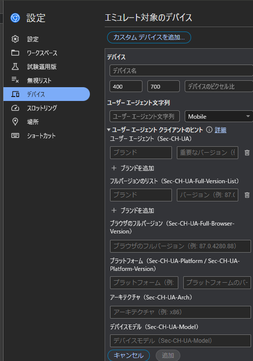

# DevTools Emulate Extractor

## なにこれ

DevTool Emulate Extractor は、ChromeやChromiumに搭載されている[DevTools](https://developer.chrome.com/docs/devtools)でスマートフォンなどのデバイスをパソコン上でエミュレートするときに使う各種項目を実機から簡単に取得できるツールです。

## 使い方

1. 実機でサイトを開きます
2. 各種項目をメモります
3. パソコンにぶち込みます
4. 完成！！

## 作成経緯

解像度などはわかるのですがピクセル比やUAがよくわからなかったので簡単に取得できるように作りました。
